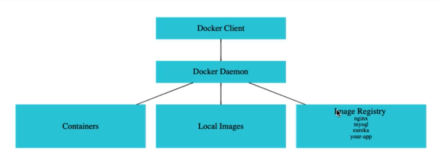

Hi guys, welcome to the chapter of Docker!

Learning goal: 

1. Basic Concepts and Terminology: Understand Docker's fundamental concepts like containers, images, repositories, etc.
2. Installation and Configuration: Learn how to install and configure Docker Engine on various operating systems.
3. Docker Images: Grasp the concept and usage of Docker images, including building images and customizing them using Dockerfile.
4. Container Lifecycle Management: Learn how to create, start, stop, and delete containers.
5. Data Management: Understand persistent data management in containers, including volumes and bind mounts.
6. Networking: Master Docker's networking modes, understanding communication between containers and with external networks.
7. Container Orchestration Tools: Familiarize yourself with Docker orchestration tools like Docker Compose and Kubernetes for managing complex applications with multiple containers.
8. Security: Learn how to securely use and protect Docker containers and images.
9. Monitoring and Logging: Understand monitoring Docker container runtime status and collecting container logs.
10. CI/CD Integration: Learn how to integrate Docker into continuous integration and continuous deployment (CI/CD) pipelines.
11. Best Practices: Master Docker best practices to ensure efficient operation and management of containerized applications.

With Docker, we are able to quickly deploy an application within a few minutes. We can do simply deployment and avoid error prone manual installations.

## Concepts

### Docker Hub

[Docker hub](https://hub.docker.com/) is a Docker registry  which contains a lot of repositories and different versions of different applications.

### Container

The running version of the image is called a container.

### Docker Architecture



- Docker Client: a client where we run commands, it sends the commands to Docker daemon for execution.
- Docker Daemon: a server component
  - execute the commands
  - manage the containers, local images
  - pull the image from the image repository
  - push the images out to the image repository

For example:

- we run `docker images`
- the Docker Client sends the command to Docker Daemon
- Docker Daemon looks at the local images and sends back the results

### Why Docker is getting more and more popular?

There are several reasons:

- standardized application packaging
  - same packaging for all types of applications, Java, Python or JS
- multi-platform support
  - local machine
  - data center
  - cloud -- AWS, Azure, GCP
- light-weight & isolation
  - containers are isolated from each other
  - virtual machines are heavy-weight

## Common Docker Commands

### Run a container

```bash
# terminate container
Ctrl + C

# when we specify a docker repository, we specify 2 things
<image repository>/<image name>:<specific version tag>

# run a container
docker run -p 5000:5000 --name=<your willing container name> <image repository>/<image name>:<specific version tag>

# run in detached mode, '-d' is a shortcut for '--detached'
docker run -d -p 5000:5000 <image repository>/<image name>:<specific version tag>
```

> `docker run` is a shortcut for `docker container run`

The great thing about the detached mode is that everything is happening in the background. Each container is assigned an ID when it's launched up

Whenever we run a container, it's part of an internal docker network called a bridge network. By default, all containers run inside the bridge work. You'll not be able to access the container unless the port is exposed outside.

```bash
# -p is a shortcut for --publish
-p <Host Port>:<Container Port>
```

Previously we take the container port 5000 and map it to a host port on the local machine at 5000.

### See docker Logs

```bash
# see the log of a container
docker logs <container id>

# '-f' means 'follow', follow the logs of a specific application
docker logs -f <container id>
```

> We don't have to use the entire container id, we can just use a substring like the first four characters.

### Images and containers

```bash
# see all images
docker images

# see all running containers, 'ls' is a shortcut for 'list'
docker container ls

# show all containers, '-a' is a shortcut for '--all'
docker container ls -a

# stop the running container
docker container stop <container id>

# pull the image, if we're not providing a tag, Docker will use 'latest' as the tag
docker pull <image name>

# search for specific images
docker search <image name>

# view the build history of a Docker image, including the creation time, command, and size of each layer
docker image history <image repository>/<image name>:<specific version tag>
or
docker image history <image id>

# look at the details behind the image
docker image inspect <image id>

# remove the image (make sure there're no containers referencing this image)
docker image remove <full image id> or <image name>

# remove the container
# if the container is running, then we should first stop the container and then remove it
docker container remove <container id>

# pause the container
docker container pause <container id>

# unpause the container
docker container unpause <container id>

# kill the container
docker container kill <container id>

# remove all stopped containers
docker container prune

# stop all running containers, '-q' means only show the ID of the container
docker container stop $(docker container ls -q)

```

> Difference between `docker kill` and `docker stop`:
>
> - `docker stop` will give the app a chance to close all stuff down (gracefully)
> - `docker kill` will kill the container immediately (not gracefully)

### Docker system

```bash
# show docker disk usage
docker system df

# get real time events from the server
docker system events

# display system-wide info
docker system info

# remove unused data (stopped containers, images which don't have a container associated with them, not used networks and build cache)
docker system prune -a

# show all the stats about the specific container
docker stats <container id>

# '-m' assigns a specific size of memory to the container, here we assgin 512MB
# '--cpu-quata' assgins how much cpu it can use, total cpu quota is 100000, here we give it 50%
docker container run -p <host port>:<container port> -m 512m  --cpu-quota=50000 <image>
```

## Docker Projects

### Build a image

First sign up for Docker Hub. Then clone the repository:

```bash
git clone http://github.com/in28minutes/devops-master-class
```

Navigate to the `projects/hello-world-python` directory. Now let's build an image for the `hello-world-python` project. Look at the `Dockerfile`. Dockerfile is the place where we specify all the instructions to create the docker image.

```dockerfile
FROM python:alpine3.10 # base image from which we are building our app
WORKDIR /app # working directory for the app
COPY . /app # copy all the files from the current directory to the app directory
RUN pip install -r requirements.txt # download the dependencies
EXPOSE 5000 # expose the port 5000 to the outside world
CMD python ./launch.py # specifies the default command to run when a container starts
```

Now we use the dockerfile to build the image.

```bash
# '-t' means tag
docker build -t <your docker hub id>/hello-world-python:0.0.2.RELEASE .
```

> We need the  current folder info (whatever info that is present in the current folder) as the **build context** to build the image, so we pass a dot at the end. 

Now let's do a `docker run` to create a container.

```bash
docker run -p 5000:5000 -d <your docker hub id>/hello-world-python:0.0.2.RELEASE
```

We can go to `localhost:5000` to see the results. There we can see the following output:

```
{"message":"Hello World Python v2"}
```

 ### Push the image to Docker Hub

```bash
# step 1: login to the Docker Hub
docker login

# step 2: make sure you use the right docker use id and push the image
docker push <your docker hub id>/hello-world-python:0.0.2.RELEASE
```

### Building efficient images

Initial Nodejs Dockerfile:

```dockerfile
FROM node:8.16.1-alpine
WORKDIR /app
COPY . /app
RUN npm install
EXPOSE 5000
CMD node index.js
```

The dependencies don't often change, but the code does. If we build the dependencies up as a separate layer, there is a high chance that the dependency layer also gets cached.

```dockerfile
FROM node:8.16.1-alpine
WORKDIR /app
# first copy the dependency as a separate layer (which doesn't change a lot)
COPY package.json /app
RUN npm install
EXPOSE 5000
# copy the code which might change
COPY . /app
CMD node index.js
```

In the original Dockerfile, using `COPY . /app` copied all files into the container, followed by running `npm install` to install dependencies. This approach caused Docker's cache to invalidate each time any file was modified, necessitating a rerun of `npm install`, even if `package.json` had not changed.

The improved Dockerfile leverages Docker's layering feature. It first copies the `package.json` file to the `/app` directory and then executes `npm install`. Because `package.json` changes infrequently, Docker effectively caches this layer, ensuring `npm install` is rerun only when `package.json` is modified.

Similarly, we can do this for the python project.

```dockerfile
# initial dockerfile
FROM python:alpine3.10
WORKDIR /app 
COPY . /app
RUN pip install -r requirements.txt
EXPOSE 5000
CMD python ./launch.py

# improved dockerfile
FROM python:alpine3.10
WORKDIR /app 
COPY requirements.txt /app/requirements.txt
RUN pip install -r requirements.txt
EXPOSE 5000
COPY . /app
CMD python ./launch.py
```

### Entrypoint vs CMD

With CMD, whatever you pass from the command line will replace the instructions you wanted to execute. For example if we are using CMD in our Dockerfile and we pass a command after the `docker run`:

```bash
docker run .... ping google.com
```

Then it will run the `ping` command, the CMD command in the Dockerfile will be replaced.

However, entrypoint doesn't worry about command line arguments. It won't be overwritten.

## Docker and Microservices

We will use 2 microservices and they talk to each other:

- currency conversion service (100 USD = 600 CNY) (depends on currency exchange service)
- currency exchange service (1 USD = 6 CNY)

The default network mode in Docker is Bridge Network. Containers which are present in the default bridge network are not able to directly talk to each other using `localhost`.

```bash
# list the networks of the containers
docker network ls

# inspect the bridge network
docker network inspect bridge
```

Use these commands we can check the network of the containers.

To make the 2 services be able to talk to each other, we create a link between them.

```bash
docker run -d -p 8000:8000 --name=currency-exchange in28min/currency-exchange:0.0.1-RELEASE

docker run -d -p 8100:8100 --name=currency-conversion --link currency-exchange in28min/currency-conversion:0.0.1-RELEASE
```

- first use `--link` to **create a link** between them

- the URL at which currency exchange service will be available : http://currency-exchange

- we need to **configure an environment variable** with the URL:

  ```bash
  docker run -d -p 8100:8100 --env CURRENCY_EXCHANGE_SERVICE_HOST=http://currency-exchange --name=currency-conversion --link currency-exchange in28min/currency-conversion:0.0.1-RELEASE
  ```

> In a Docker containerized environment, a URL like `http://currency-exchange` serves as a **network alias** for inter-container communication. Specifically, it refers to the network address of another container named `currency-exchange` running within the same Docker network (e.g., `currency-network`).
>
> Typically, Docker containers can use container names as hostnames to communicate with each other without needing to use IP addresses. This alias resolution is facilitated by Docker's built-in DNS service.
>
> For instance, suppose you have two containers running simultaneously in the `currency-network` Docker network:
>
> - The `currency-exchange` container provides a currency exchange service, possibly running on port 8000.
> - The `currency-conversion` container depends on the `currency-exchange` service for currency conversion and runs on port 8100.
>
> By using `--network=currency-network` in the `docker run` command, both containers are connected to the same network. Therefore, the `currency-conversion` container can access the service provided by the `currency-exchange` container using a URL like `http://currency-exchange`, without needing to know the specific IP address or port number.
>
> In summary, `http://currency-exchange` is a Docker network internal alias used for inter-container communication and service invocation, simplifying the configuration and management of connections between containers.

The other option is to create a custom network, which means we can create a network for our currency services alone.

```bash
docker network create currency-network

docker run -d -p 8000:8000 --name=currency-exchange --network=currency-network in28min/currency-exchange:0.0.1-RELEASE

docker run -d -p 8100:8100 --env CURRENCY_EXCHANGE_SERVICE_HOST=http://currency-exchange --name=currency-conversion --network=currency-network in28min/currency-conversion:0.0.1-RELEASE
```

> Note: the env variable doesn't change.

## Docker Compose

As you can see, our command is getting longer. So we can use a more powerful tool called `docker compose`. It's a tool for defining and running multi-container docker applications.

Here is the `docker-compose.yml` file:

```yaml
version: '3.7'
services:
  currency-exchange:
    image: in28min/currency-exchange:0.0.1-RELEASE
    ports:
      - "8000:8000"
    restart: always
    networks:
      - currency-compose-network

  currency-conversion:
    image: in28min/currency-conversion:0.0.1-RELEASE
    ports:
      - "8100:8100"
    restart: always
    environment:
      CURRENCY_EXCHANGE_SERVICE_HOST: http://currency-exchange
    depends_on:
      - currency-exchange
    networks:
      - currency-compose-network
  
# Networks to be created to facilitate communication between containers
networks:
  currency-compose-network:
```

Then we can run the following command:

```bash
docker-compose up

# shut down
docker-compose down

# see events going on
docker-compose events

# show the configuration, useful for debugging errors and validate your yml file
docker-compose config

# show the containers
docker-compose ps

# show the top process of each container
docker-compose top

docker-compose pause

docker-compose unpause

docker-compose stop/kill
```

